# Radiografia de Base de Datos (Snapshot)

**Generado:** 2026-01-26 17:09:16

**Total de tablas:** 32

---

## Indice de Tablas

- [tb_cat_estatus_global](#tb-cat-estatus-global)
- [tb_cat_motivos_cambio_deadline](#tb-cat-motivos-cambio-deadline)
- [tb_cat_motivos_cierre](#tb-cat-motivos-cierre)
- [tb_cat_motivos_retrabajo](#tb-cat-motivos-retrabajo)
- [tb_cat_origenes_adjuntos](#tb-cat-origenes-adjuntos)
- [tb_cat_tecnologias](#tb-cat-tecnologias)
- [tb_cat_tipos_solicitud](#tb-cat-tipos-solicitud)
- [tb_clientes](#tb-clientes)
- [tb_comentarios_workflow](#tb-comentarios-workflow)
- [tb_compras_tracking](#tb-compras-tracking)
- [tb_config_emails](#tb-config-emails)
- [tb_config_umbrales_kpi](#tb-config-umbrales-kpi)
- [tb_configuracion_global](#tb-configuracion-global)
- [tb_correos_notificaciones](#tb-correos-notificaciones)
- [tb_departamento_modulos](#tb-departamento-modulos)
- [tb_departamentos_catalogo](#tb-departamentos-catalogo)
- [tb_detalles_bess](#tb-detalles-bess)
- [tb_documentos_attachments](#tb-documentos-attachments)
- [tb_email_defaults](#tb-email-defaults)
- [tb_historial_cambios_deadline](#tb-historial-cambios-deadline)
- [tb_historial_estatus](#tb-historial-estatus)
- [tb_levantamientos](#tb-levantamientos)
- [tb_levantamientos_historial](#tb-levantamientos-historial)
- [tb_modulos_catalogo](#tb-modulos-catalogo)
- [tb_notificaciones](#tb-notificaciones)
- [tb_oportunidades](#tb-oportunidades)
- [tb_permisos_modulos](#tb-permisos-modulos)
- [tb_proyectos](#tb-proyectos)
- [tb_sitios_oportunidad](#tb-sitios-oportunidad)
- [tb_usuarios](#tb-usuarios)
- [vw_cambios_deadline_resumen](#vw-cambios-deadline-resumen)
- [vw_metricas_sitios](#vw-metricas-sitios)

---

## Tabla: `tb_cat_estatus_global`

### Columnas

| Columna | Tipo | Null | Default |
| :--- | :--- | :--- | :--- |
| **id** | `integer` | NO | `nextval('tb_cat_estatus_global_id_seq'::regclass)` |
| **nombre** | `character varying(50)` | NO | `-` |
| **descripcion** | `text` | YES | `-` |
| **color_hex** | `character varying(10)` | YES | `-` |
| **activo** | `boolean` | YES | `true` |
| **modulo_aplicable** | `character varying(50)` | YES | `'COMERCIAL'::character varying` |
| **cuenta_para_kpi** | `boolean` | YES | `false` |
| **es_estatus_final** | `boolean` | YES | `false` |

**Primary Key:** `id`

### Indices

| Nombre Indice | Columna | Unique |
| :--- | :--- | :--- |
| `idx_estatus_modulo` | `modulo_aplicable` | No |
| `tb_cat_estatus_global_nombre_key` | `nombre` | Si |

### Constraints Adicionales

- **CHECK:** `id IS NOT NULL`
- **CHECK:** `nombre IS NOT NULL`
- **UNIQUE:** `nombre`

**Estadisticas:** 13 filas | Tamano: 64 kB

---

## Tabla: `tb_cat_motivos_cambio_deadline`

**Descripcion:** Catálogo de motivos para cambiar la fecha de entrega negociada

### Columnas

| Columna | Tipo | Null | Default |
| :--- | :--- | :--- | :--- |
| **id** | `integer` | NO | `nextval('tb_cat_motivos_cambio_deadline_id_seq'...` |
| **codigo** | `character varying(30)` | NO | `-` |
| **nombre** | `character varying(100)` | NO | `-` |
| **descripcion** | `text` | YES | `-` |
| **activo** | `boolean` | YES | `true` |
| **orden** | `integer` | YES | `0` |
| **created_at** | `timestamp with time zone` | YES | `now()` |

**Primary Key:** `id`

### Indices

| Nombre Indice | Columna | Unique |
| :--- | :--- | :--- |
| `tb_cat_motivos_cambio_deadline_codigo_key` | `codigo` | Si |

### Constraints Adicionales

- **CHECK:** `id IS NOT NULL`
- **CHECK:** `codigo IS NOT NULL`
- **CHECK:** `nombre IS NOT NULL`
- **UNIQUE:** `codigo`

**Estadisticas:** 8 filas | Tamano: 48 kB

---

## Tabla: `tb_cat_motivos_cierre`

### Columnas

| Columna | Tipo | Null | Default |
| :--- | :--- | :--- | :--- |
| **id** | `integer` | NO | `nextval('tb_cat_motivos_cierre_id_seq'::regclass)` |
| **categoria** | `character varying(50)` | NO | `-` |
| **motivo** | `character varying(255)` | NO | `-` |
| **aplicacion** | `character varying(20)` | NO | `-` |
| **activo** | `boolean` | YES | `true` |

**Primary Key:** `id`

### Constraints Adicionales

- **CHECK:** `id IS NOT NULL`
- **CHECK:** `categoria IS NOT NULL`
- **CHECK:** `motivo IS NOT NULL`
- **CHECK:** `aplicacion IS NOT NULL`
- **CHECK:** `((aplicacion)::text = ANY ((ARRAY['CANCELACION'::character varying, 'PERDIDA'::character varying, 'A...`

**Estadisticas:** 18 filas | Tamano: 24 kB

---

## Tabla: `tb_cat_motivos_retrabajo`

**Descripcion:** Catálogo de motivos por los cuales una solicitud/sitio requirió retrabajo

### Columnas

| Columna | Tipo | Null | Default |
| :--- | :--- | :--- | :--- |
| **id** | `integer` | NO | `nextval('tb_cat_motivos_retrabajo_id_seq'::regc...` |
| **codigo** | `character varying(30)` | NO | `-` |
| **nombre** | `character varying(100)` | NO | `-` |
| **descripcion** | `text` | YES | `-` |
| **activo** | `boolean` | YES | `true` |
| **orden** | `integer` | YES | `0` |
| **created_at** | `timestamp with time zone` | YES | `now()` |

**Primary Key:** `id`

### Indices

| Nombre Indice | Columna | Unique |
| :--- | :--- | :--- |
| `tb_cat_motivos_retrabajo_codigo_key` | `codigo` | Si |

### Constraints Adicionales

- **CHECK:** `id IS NOT NULL`
- **CHECK:** `codigo IS NOT NULL`
- **CHECK:** `nombre IS NOT NULL`
- **UNIQUE:** `codigo`

**Estadisticas:** 8 filas | Tamano: 48 kB

---

## Tabla: `tb_cat_origenes_adjuntos`

### Columnas

| Columna | Tipo | Null | Default |
| :--- | :--- | :--- | :--- |
| **id** | `integer` | NO | `nextval('tb_cat_origenes_adjuntos_id_seq'::regc...` |
| **slug** | `character varying(50)` | NO | `-` |
| **descripcion** | `text` | YES | `-` |
| **activo** | `boolean` | YES | `true` |
| **created_at** | `timestamp with time zone` | YES | `now()` |

**Primary Key:** `id`

### Indices

| Nombre Indice | Columna | Unique |
| :--- | :--- | :--- |
| `tb_cat_origenes_adjuntos_slug_key` | `slug` | Si |

### Constraints Adicionales

- **CHECK:** `id IS NOT NULL`
- **CHECK:** `slug IS NOT NULL`
- **UNIQUE:** `slug`

**Estadisticas:** 4 filas | Tamano: 48 kB

---

## Tabla: `tb_cat_tecnologias`

### Columnas

| Columna | Tipo | Null | Default |
| :--- | :--- | :--- | :--- |
| **id** | `integer` | NO | `nextval('tb_cat_tecnologias_id_seq'::regclass)` |
| **nombre** | `character varying(50)` | NO | `-` |
| **activo** | `boolean` | YES | `true` |

**Primary Key:** `id`

### Indices

| Nombre Indice | Columna | Unique |
| :--- | :--- | :--- |
| `tb_cat_tecnologias_nombre_key` | `nombre` | Si |

### Constraints Adicionales

- **CHECK:** `id IS NOT NULL`
- **CHECK:** `nombre IS NOT NULL`
- **UNIQUE:** `nombre`

**Estadisticas:** 5 filas | Tamano: 40 kB

---

## Tabla: `tb_cat_tipos_solicitud`

### Columnas

| Columna | Tipo | Null | Default |
| :--- | :--- | :--- | :--- |
| **id** | `integer` | NO | `nextval('tb_cat_tipos_solicitud_id_seq'::regclass)` |
| **nombre** | `character varying(50)` | NO | `-` |
| **codigo_interno** | `character varying(20)` | YES | `-` |
| **activo** | `boolean` | YES | `true` |
| **es_seguimiento** | `boolean` | YES | `false` |

**Primary Key:** `id`

### Indices

| Nombre Indice | Columna | Unique |
| :--- | :--- | :--- |
| `tb_cat_tipos_solicitud_nombre_key` | `nombre` | Si |

### Constraints Adicionales

- **CHECK:** `id IS NOT NULL`
- **CHECK:** `nombre IS NOT NULL`
- **UNIQUE:** `nombre`

**Estadisticas:** 8 filas | Tamano: 40 kB

---

## Tabla: `tb_clientes`

### Columnas

| Columna | Tipo | Null | Default |
| :--- | :--- | :--- | :--- |
| **id** | `uuid` | NO | `gen_random_uuid()` |
| **nombre_fiscal** | `text` | NO | `-` |
| **direccion_fiscal** | `text` | YES | `-` |
| **contacto_principal** | `text` | YES | `-` |
| **created_at** | `timestamp with time zone` | YES | `now()` |

**Primary Key:** `id`

### Indices

| Nombre Indice | Columna | Unique |
| :--- | :--- | :--- |
| `tb_clientes_nombre_fiscal_unique` | `nombre_fiscal` | Si |

### Constraints Adicionales

- **CHECK:** `id IS NOT NULL`
- **CHECK:** `nombre_fiscal IS NOT NULL`
- **UNIQUE:** `nombre_fiscal`

**Estadisticas:** 244 filas | Tamano: 88 kB

---

## Tabla: `tb_comentarios_workflow`

### Columnas

| Columna | Tipo | Null | Default |
| :--- | :--- | :--- | :--- |
| **id** | `uuid` | NO | `uuid_generate_v4()` |
| **id_oportunidad** | `uuid` | NO | `-` |
| **usuario_email** | `character varying(100)` | NO | `-` |
| **comentario** | `text` | NO | `-` |
| **departamento_origen** | `character varying(50)` | YES | `-` |
| **fecha_comentario** | `timestamp with time zone` | YES | `now()` |
| **usuario_id** | `uuid` | YES | `-` |
| **usuario_nombre** | `text` | YES | `-` |
| **modulo_origen** | `character varying(50)` | YES | `-` |

**Primary Key:** `id`

### Foreign Keys (Relaciones)

| Columna Local | Tabla Referenciada | Columna Ref | Delete | Update |
| :--- | :--- | :--- | :--- | :--- |
| `id_oportunidad` | `tb_oportunidades` | `id_oportunidad` | CASCADE | NO ACTION |

### Indices

| Nombre Indice | Columna | Unique |
| :--- | :--- | :--- |
| `idx_bitacora_oportunidad` | `id_oportunidad` | No |
| `idx_comentarios_oportunidad` | `id_oportunidad` | No |

### Constraints Adicionales

- **CHECK:** `id IS NOT NULL`
- **CHECK:** `id_oportunidad IS NOT NULL`
- **CHECK:** `usuario_email IS NOT NULL`
- **CHECK:** `comentario IS NOT NULL`

**Estadisticas:** 1 filas | Tamano: 64 kB

---

## Tabla: `tb_compras_tracking`

### Columnas

| Columna | Tipo | Null | Default |
| :--- | :--- | :--- | :--- |
| **id_tracking** | `uuid` | NO | `gen_random_uuid()` |
| **id_proyecto** | `uuid` | NO | `-` |
| **descripcion_proveedor** | `text` | NO | `-` |
| **descripcion_interna** | `text` | NO | `-` |
| **categoria_gasto** | `text` | YES | `-` |
| **monto** | `real` | NO | `-` |
| **fecha_factura** | `date` | NO | `-` |
| **status_pago** | `text` | NO | `-` |
| **creado_por_id** | `uuid` | NO | `-` |

**Primary Key:** `id_tracking`

### Foreign Keys (Relaciones)

| Columna Local | Tabla Referenciada | Columna Ref | Delete | Update |
| :--- | :--- | :--- | :--- | :--- |
| `creado_por_id` | `tb_usuarios` | `id_usuario` | NO ACTION | NO ACTION |
| `id_proyecto` | `tb_proyectos` | `id_proyecto` | NO ACTION | NO ACTION |

### Indices

| Nombre Indice | Columna | Unique |
| :--- | :--- | :--- |
| `idx_compras_proyecto` | `id_proyecto` | No |

### Constraints Adicionales

- **CHECK:** `id_tracking IS NOT NULL`
- **CHECK:** `id_proyecto IS NOT NULL`
- **CHECK:** `descripcion_proveedor IS NOT NULL`
- **CHECK:** `descripcion_interna IS NOT NULL`
- **CHECK:** `monto IS NOT NULL`
- **CHECK:** `fecha_factura IS NOT NULL`
- **CHECK:** `status_pago IS NOT NULL`
- **CHECK:** `creado_por_id IS NOT NULL`

**Estadisticas:** 0 filas | Tamano: 24 kB

---

## Tabla: `tb_config_emails`

### Columnas

| Columna | Tipo | Null | Default |
| :--- | :--- | :--- | :--- |
| **id** | `integer` | NO | `nextval('tb_config_emails_id_seq'::regclass)` |
| **modulo** | `character varying(50)` | NO | `-` |
| **trigger_field** | `character varying(50)` | NO | `-` |
| **trigger_value** | `character varying(50)` | NO | `-` |
| **email_to_add** | `character varying(150)` | NO | `-` |
| **type** | `character varying(10)` | YES | `-` |
| **descripcion** | `text` | YES | `-` |
| **created_at** | `timestamp without time zone` | YES | `now()` |

**Primary Key:** `id`

### Constraints Adicionales

- **CHECK:** `id IS NOT NULL`
- **CHECK:** `modulo IS NOT NULL`
- **CHECK:** `trigger_field IS NOT NULL`
- **CHECK:** `trigger_value IS NOT NULL`
- **CHECK:** `email_to_add IS NOT NULL`
- **CHECK:** `((type)::text = ANY (ARRAY[('TO'::character varying)::text, ('CC'::character varying)::text]))`

**Estadisticas:** 5 filas | Tamano: 32 kB

---

## Tabla: `tb_config_umbrales_kpi`

**Descripcion:** Configuración de umbrales para colores de KPIs por departamento

### Columnas

| Columna | Tipo | Null | Default |
| :--- | :--- | :--- | :--- |
| **id** | `integer` | NO | `nextval('tb_config_umbrales_kpi_id_seq'::regclass)` |
| **tipo_kpi** | `character varying(50)` | NO | `-` |
| **departamento** | `character varying(50)` | YES | `'SIMULACION'::character varying` |
| **umbral_excelente** | `numeric` | NO | `-` |
| **umbral_bueno** | `numeric` | NO | `-` |
| **color_excelente** | `character varying(50)` | YES | `'emerald'::character varying` |
| **color_bueno** | `character varying(50)` | YES | `'yellow'::character varying` |
| **color_critico** | `character varying(50)` | YES | `'red'::character varying` |
| **activo** | `boolean` | YES | `true` |
| **fecha_vigencia** | `timestamp with time zone` | YES | `now()` |
| **modificado_por_id** | `uuid` | YES | `-` |
| **fecha_modificacion** | `timestamp with time zone` | YES | `now()` |

**Primary Key:** `id`

### Foreign Keys (Relaciones)

| Columna Local | Tabla Referenciada | Columna Ref | Delete | Update |
| :--- | :--- | :--- | :--- | :--- |
| `modificado_por_id` | `tb_usuarios` | `id_usuario` | NO ACTION | NO ACTION |

### Indices

| Nombre Indice | Columna | Unique |
| :--- | :--- | :--- |
| `idx_config_umbrales_dept_activo` | `tipo_kpi` | No |
| `idx_config_umbrales_dept_activo` | `departamento` | No |
| `idx_config_umbrales_dept_activo` | `activo` | No |
| `uq_kpi_dept_only_active` | `tipo_kpi` | Si |
| `uq_kpi_dept_only_active` | `departamento` | Si |

### Constraints Adicionales

- **CHECK:** `id IS NOT NULL`
- **CHECK:** `tipo_kpi IS NOT NULL`
- **CHECK:** `umbral_excelente IS NOT NULL`
- **CHECK:** `umbral_bueno IS NOT NULL`
- **CHECK:** `((umbral_excelente > umbral_bueno) AND (umbral_bueno > (0)::numeric) AND (umbral_excelente <= (100):...`

**Estadisticas:** 8 filas | Tamano: 56 kB

---

## Tabla: `tb_configuracion_global`

### Columnas

| Columna | Tipo | Null | Default |
| :--- | :--- | :--- | :--- |
| **clave** | `character varying(50)` | NO | `-` |
| **valor** | `text` | NO | `-` |
| **descripcion** | `text` | YES | `-` |
| **tipo_dato** | `character varying(20)` | YES | `'string'::character varying` |

**Primary Key:** `clave`

### Constraints Adicionales

- **CHECK:** `clave IS NOT NULL`
- **CHECK:** `valor IS NOT NULL`

**Estadisticas:** 20 filas | Tamano: 64 kB

---

## Tabla: `tb_correos_notificaciones`

**Descripcion:** Configuración de buzones compartidos para envío de notificaciones por departamento

### Columnas

| Columna | Tipo | Null | Default |
| :--- | :--- | :--- | :--- |
| **id** | `uuid` | NO | `gen_random_uuid()` |
| **departamento** | `character varying(50)` | NO | `-` |
| **email_remitente** | `character varying(255)` | NO | `-` |
| **nombre_remitente** | `character varying(255)` | NO | `-` |
| **descripcion** | `text` | YES | `-` |
| **activo** | `boolean` | YES | `true` |
| **created_at** | `timestamp with time zone` | YES | `now()` |
| **updated_at** | `timestamp with time zone` | YES | `now()` |
| **updated_by** | `uuid` | YES | `-` |

**Primary Key:** `id`

### Foreign Keys (Relaciones)

| Columna Local | Tabla Referenciada | Columna Ref | Delete | Update |
| :--- | :--- | :--- | :--- | :--- |
| `updated_by` | `tb_usuarios` | `id_usuario` | NO ACTION | NO ACTION |

### Indices

| Nombre Indice | Columna | Unique |
| :--- | :--- | :--- |
| `idx_correos_notif_activo` | `activo` | No |
| `idx_correos_notif_departamento` | `departamento` | No |
| `uq_departamento_activo` | `departamento` | Si |
| `uq_departamento_activo` | `activo` | Si |

### Constraints Adicionales

- **CHECK:** `id IS NOT NULL`
- **CHECK:** `departamento IS NOT NULL`
- **CHECK:** `email_remitente IS NOT NULL`
- **CHECK:** `nombre_remitente IS NOT NULL`
- **UNIQUE:** `departamento`
- **UNIQUE:** `activo`

**Estadisticas:** 1 filas | Tamano: 80 kB

---

## Tabla: `tb_departamento_modulos`

### Columnas

| Columna | Tipo | Null | Default |
| :--- | :--- | :--- | :--- |
| **id** | `uuid` | NO | `gen_random_uuid()` |
| **departamento_slug** | `character varying(50)` | YES | `-` |
| **modulo_slug** | `character varying(50)` | YES | `-` |
| **rol_default** | `character varying(20)` | YES | `'viewer'::character varying` |

**Primary Key:** `id`

### Foreign Keys (Relaciones)

| Columna Local | Tabla Referenciada | Columna Ref | Delete | Update |
| :--- | :--- | :--- | :--- | :--- |
| `departamento_slug` | `tb_departamentos_catalogo` | `slug` | NO ACTION | NO ACTION |
| `modulo_slug` | `tb_modulos_catalogo` | `slug` | NO ACTION | NO ACTION |

### Indices

| Nombre Indice | Columna | Unique |
| :--- | :--- | :--- |
| `tb_departamento_modulos_unique` | `departamento_slug` | Si |
| `tb_departamento_modulos_unique` | `modulo_slug` | Si |

### Constraints Adicionales

- **CHECK:** `id IS NOT NULL`
- **UNIQUE:** `departamento_slug`
- **UNIQUE:** `modulo_slug`

**Estadisticas:** 23 filas | Tamano: 40 kB

---

## Tabla: `tb_departamentos_catalogo`

### Columnas

| Columna | Tipo | Null | Default |
| :--- | :--- | :--- | :--- |
| **id** | `uuid` | NO | `gen_random_uuid()` |
| **nombre** | `character varying(100)` | NO | `-` |
| **slug** | `character varying(50)` | NO | `-` |
| **descripcion** | `text` | YES | `-` |
| **is_active** | `boolean` | YES | `true` |
| **created_at** | `timestamp without time zone` | YES | `now()` |

**Primary Key:** `id`

### Indices

| Nombre Indice | Columna | Unique |
| :--- | :--- | :--- |
| `tb_departamentos_catalogo_nombre_key` | `nombre` | Si |
| `tb_departamentos_catalogo_slug_key` | `slug` | Si |

### Constraints Adicionales

- **CHECK:** `id IS NOT NULL`
- **CHECK:** `nombre IS NOT NULL`
- **CHECK:** `slug IS NOT NULL`
- **UNIQUE:** `nombre`
- **UNIQUE:** `slug`

**Estadisticas:** 8 filas | Tamano: 64 kB

---

## Tabla: `tb_detalles_bess`

### Columnas

| Columna | Tipo | Null | Default |
| :--- | :--- | :--- | :--- |
| **id** | `uuid` | NO | `uuid_generate_v4()` |
| **id_oportunidad** | `uuid` | NO | `-` |
| **cargas_criticas_kw** | `numeric` | YES | `-` |
| **tiene_motores** | `boolean` | YES | `false` |
| **potencia_motor_hp** | `numeric` | YES | `-` |
| **tiempo_autonomia** | `character varying(50)` | YES | `-` |
| **voltaje_operacion** | `character varying(50)` | YES | `-` |
| **cargas_separadas** | `boolean` | YES | `-` |
| **tiene_planta_emergencia** | `boolean` | YES | `false` |
| **creado_en** | `timestamp with time zone` | YES | `now()` |
| **uso_sistema_json** | `jsonb` | YES | `-` |

**Primary Key:** `id`

### Foreign Keys (Relaciones)

| Columna Local | Tabla Referenciada | Columna Ref | Delete | Update |
| :--- | :--- | :--- | :--- | :--- |
| `id_oportunidad` | `tb_oportunidades` | `id_oportunidad` | CASCADE | NO ACTION |

### Indices

| Nombre Indice | Columna | Unique |
| :--- | :--- | :--- |
| `idx_bess_oportunidad` | `id_oportunidad` | No |

### Constraints Adicionales

- **CHECK:** `id IS NOT NULL`
- **CHECK:** `id_oportunidad IS NOT NULL`

**Estadisticas:** 0 filas | Tamano: 24 kB

---

## Tabla: `tb_documentos_attachments`

### Columnas

| Columna | Tipo | Null | Default |
| :--- | :--- | :--- | :--- |
| **id_documento** | `uuid` | NO | `-` |
| **nombre_archivo** | `text` | NO | `-` |
| **url_sharepoint** | `text` | YES | `-` |
| **drive_item_id** | `text` | YES | `-` |
| **parent_drive_id** | `text` | YES | `-` |
| **tipo_contenido** | `text` | YES | `-` |
| **tamano_bytes** | `bigint` | YES | `-` |
| **origen_slug** | `character varying(50)` | NO | `'comentario'::character varying` |
| **id_oportunidad** | `uuid` | YES | `-` |
| **id_comentario** | `uuid` | YES | `-` |
| **subido_por_id** | `uuid` | YES | `-` |
| **fecha_subida** | `timestamp with time zone` | YES | `now()` |
| **metadata** | `jsonb` | YES | `'{}'::jsonb` |
| **activo** | `boolean` | YES | `true` |

**Primary Key:** `id_documento`

### Foreign Keys (Relaciones)

| Columna Local | Tabla Referenciada | Columna Ref | Delete | Update |
| :--- | :--- | :--- | :--- | :--- |
| `id_comentario` | `tb_comentarios_workflow` | `id` | NO ACTION | NO ACTION |
| `id_oportunidad` | `tb_oportunidades` | `id_oportunidad` | NO ACTION | NO ACTION |
| `origen_slug` | `tb_cat_origenes_adjuntos` | `slug` | NO ACTION | NO ACTION |
| `subido_por_id` | `tb_usuarios` | `id_usuario` | NO ACTION | NO ACTION |

### Indices

| Nombre Indice | Columna | Unique |
| :--- | :--- | :--- |
| `idx_attach_comentario` | `id_comentario` | No |
| `idx_attach_drive_item` | `drive_item_id` | No |
| `idx_attach_oportunidad` | `id_oportunidad` | No |
| `idx_attach_origen` | `origen_slug` | No |
| `tb_documentos_attachments_drive_item_id_key` | `drive_item_id` | Si |

### Constraints Adicionales

- **CHECK:** `id_documento IS NOT NULL`
- **CHECK:** `nombre_archivo IS NOT NULL`
- **CHECK:** `origen_slug IS NOT NULL`
- **UNIQUE:** `drive_item_id`

**Estadisticas:** 1 filas | Tamano: 112 kB

---

## Tabla: `tb_email_defaults`

### Columnas

| Columna | Tipo | Null | Default |
| :--- | :--- | :--- | :--- |
| **id** | `integer` | NO | `nextval('tb_email_defaults_id_seq'::regclass)` |
| **default_to** | `text` | YES | `''::text` |
| **default_cc** | `text` | YES | `''::text` |
| **default_cco** | `text` | YES | `''::text` |

**Primary Key:** `id`

### Constraints Adicionales

- **CHECK:** `id IS NOT NULL`

**Estadisticas:** 1 filas | Tamano: 32 kB

---

## Tabla: `tb_historial_cambios_deadline`

**Descripcion:** Log de todos los cambios realizados al deadline negociado de una oportunidad

### Columnas

| Columna | Tipo | Null | Default |
| :--- | :--- | :--- | :--- |
| **id** | `integer` | NO | `nextval('tb_historial_cambios_deadline_id_seq':...` |
| **id_oportunidad** | `uuid` | NO | `-` |
| **deadline_anterior** | `timestamp with time zone` | YES | `-` |
| **deadline_nuevo** | `timestamp with time zone` | NO | `-` |
| **id_motivo_cambio** | `integer` | NO | `-` |
| **comentario** | `text` | YES | `-` |
| **usuario_id** | `uuid` | NO | `-` |
| **usuario_nombre** | `character varying(150)` | YES | `-` |
| **created_at** | `timestamp with time zone` | YES | `now()` |

**Primary Key:** `id`

### Foreign Keys (Relaciones)

| Columna Local | Tabla Referenciada | Columna Ref | Delete | Update |
| :--- | :--- | :--- | :--- | :--- |
| `id_motivo_cambio` | `tb_cat_motivos_cambio_deadline` | `id` | NO ACTION | NO ACTION |
| `id_oportunidad` | `tb_oportunidades` | `id_oportunidad` | CASCADE | NO ACTION |
| `usuario_id` | `tb_usuarios` | `id_usuario` | NO ACTION | NO ACTION |

### Indices

| Nombre Indice | Columna | Unique |
| :--- | :--- | :--- |
| `idx_historial_deadline_fecha` | `created_at` | No |
| `idx_historial_deadline_oportunidad` | `id_oportunidad` | No |
| `idx_historial_deadline_usuario` | `usuario_id` | No |

### Constraints Adicionales

- **CHECK:** `id IS NOT NULL`
- **CHECK:** `id_oportunidad IS NOT NULL`
- **CHECK:** `deadline_nuevo IS NOT NULL`
- **CHECK:** `id_motivo_cambio IS NOT NULL`
- **CHECK:** `usuario_id IS NOT NULL`

**Estadisticas:** 0 filas | Tamano: 40 kB

---

## Tabla: `tb_historial_estatus`

**Descripcion:** Historial completo de cambios de estatus con ajuste SLA

### Columnas

| Columna | Tipo | Null | Default |
| :--- | :--- | :--- | :--- |
| **id** | `uuid` | NO | `gen_random_uuid()` |
| **id_oportunidad** | `uuid` | NO | `-` |
| **id_estatus_anterior** | `integer` | YES | `-` |
| **id_estatus_nuevo** | `integer` | NO | `-` |
| **fecha_cambio_real** | `timestamp with time zone` | NO | `-` |
| **fecha_cambio_sla** | `timestamp with time zone` | NO | `-` |
| **cambiado_por_id** | `uuid` | YES | `-` |
| **notas** | `text` | YES | `-` |
| **fecha_creacion** | `timestamp with time zone` | YES | `now()` |

**Primary Key:** `id`

### Foreign Keys (Relaciones)

| Columna Local | Tabla Referenciada | Columna Ref | Delete | Update |
| :--- | :--- | :--- | :--- | :--- |
| `cambiado_por_id` | `tb_usuarios` | `id_usuario` | NO ACTION | NO ACTION |
| `id_estatus_anterior` | `tb_cat_estatus_global` | `id` | NO ACTION | NO ACTION |
| `id_estatus_nuevo` | `tb_cat_estatus_global` | `id` | NO ACTION | NO ACTION |
| `id_oportunidad` | `tb_oportunidades` | `id_oportunidad` | CASCADE | NO ACTION |

### Indices

| Nombre Indice | Columna | Unique |
| :--- | :--- | :--- |
| `idx_historial_estatus_cambio` | `id_estatus_anterior` | No |
| `idx_historial_estatus_cambio` | `id_estatus_nuevo` | No |
| `idx_historial_estatus_nuevo` | `id_estatus_nuevo` | No |
| `idx_historial_fecha_cambio` | `fecha_cambio_sla` | No |
| `idx_historial_oportunidad` | `id_oportunidad` | No |

### Constraints Adicionales

- **CHECK:** `id IS NOT NULL`
- **CHECK:** `id_oportunidad IS NOT NULL`
- **CHECK:** `id_estatus_nuevo IS NOT NULL`
- **CHECK:** `fecha_cambio_real IS NOT NULL`
- **CHECK:** `fecha_cambio_sla IS NOT NULL`
- **CHECK:** `((id_estatus_anterior IS NULL) OR (id_estatus_anterior <> id_estatus_nuevo))`

**Estadisticas:** 497 filas | Tamano: 240 kB

---

## Tabla: `tb_levantamientos`

**Descripcion:** Gestión de levantamientos de sitio con sistema Kanban. Cada registro representa una solicitud de levantamiento técnico.

### Columnas

| Columna | Tipo | Null | Default |
| :--- | :--- | :--- | :--- |
| **id_levantamiento** | `uuid` | NO | `gen_random_uuid()` |
| **id_sitio** | `uuid` | NO | `-` |
| **solicitado_por_id** | `uuid` | NO | `-` |
| **tecnico_asignado_id** | `uuid` | YES | `-` |
| **fecha_solicitud** | `timestamp with time zone` | YES | `now()` |
| **jefe_area_id** | `uuid` | YES | `-` |
| **id_estatus_global** | `integer` | NO | `8` |
| **fecha_visita_programada** | `timestamp with time zone` | YES | `-` |
| **id_oportunidad** | `uuid` | YES | `-` |
| **created_at** | `timestamp with time zone` | YES | `now()` |
| **updated_at** | `timestamp with time zone` | YES | `now()` |
| **updated_by_id** | `uuid` | YES | `-` |

**Primary Key:** `id_levantamiento`

### Foreign Keys (Relaciones)

| Columna Local | Tabla Referenciada | Columna Ref | Delete | Update |
| :--- | :--- | :--- | :--- | :--- |
| `id_oportunidad` | `tb_oportunidades` | `id_oportunidad` | CASCADE | NO ACTION |
| `updated_by_id` | `tb_usuarios` | `id_usuario` | SET NULL | NO ACTION |
| `id_estatus_global` | `tb_cat_estatus_global` | `id` | NO ACTION | NO ACTION |
| `id_sitio` | `tb_sitios_oportunidad` | `id_sitio` | NO ACTION | NO ACTION |
| `jefe_area_id` | `tb_usuarios` | `id_usuario` | NO ACTION | NO ACTION |
| `solicitado_por_id` | `tb_usuarios` | `id_usuario` | NO ACTION | NO ACTION |
| `tecnico_asignado_id` | `tb_usuarios` | `id_usuario` | NO ACTION | NO ACTION |

### Indices

| Nombre Indice | Columna | Unique |
| :--- | :--- | :--- |
| `idx_lev_created` | `created_at` | No |
| `idx_lev_estatus` | `id_estatus_global` | No |
| `idx_lev_jefe` | `jefe_area_id` | No |
| `idx_lev_oportunidad` | `id_oportunidad` | No |
| `idx_lev_tecnico` | `tecnico_asignado_id` | No |
| `idx_levantamiento_sitio` | `id_sitio` | No |

### Constraints Adicionales

- **CHECK:** `id_levantamiento IS NOT NULL`
- **CHECK:** `id_sitio IS NOT NULL`
- **CHECK:** `solicitado_por_id IS NOT NULL`
- **CHECK:** `id_estatus_global IS NOT NULL`

**Estadisticas:** 0 filas | Tamano: 64 kB

---

## Tabla: `tb_levantamientos_historial`

**Descripcion:** Registro automático de todas las transiciones de estado de levantamientos. Permite auditoría completa y cálculo de tiempos en cada fase.

### Columnas

| Columna | Tipo | Null | Default |
| :--- | :--- | :--- | :--- |
| **id** | `uuid` | NO | `gen_random_uuid()` |
| **id_levantamiento** | `uuid` | NO | `-` |
| **id_estatus_anterior** | `integer` | YES | `-` |
| **id_estatus_nuevo** | `integer` | NO | `-` |
| **fecha_transicion** | `timestamp with time zone` | YES | `now()` |
| **modificado_por_id** | `uuid` | NO | `-` |
| **modificado_por_nombre** | `text` | NO | `-` |
| **modificado_por_email** | `text` | NO | `-` |
| **observaciones** | `text` | YES | `-` |
| **metadata** | `jsonb` | YES | `'{}'::jsonb` |

**Primary Key:** `id`

### Foreign Keys (Relaciones)

| Columna Local | Tabla Referenciada | Columna Ref | Delete | Update |
| :--- | :--- | :--- | :--- | :--- |
| `id_estatus_anterior` | `tb_cat_estatus_global` | `id` | SET NULL | NO ACTION |
| `id_estatus_nuevo` | `tb_cat_estatus_global` | `id` | RESTRICT | NO ACTION |
| `id_levantamiento` | `tb_levantamientos` | `id_levantamiento` | CASCADE | NO ACTION |
| `modificado_por_id` | `tb_usuarios` | `id_usuario` | SET NULL | NO ACTION |

### Indices

| Nombre Indice | Columna | Unique |
| :--- | :--- | :--- |
| `idx_lev_hist_fecha` | `fecha_transicion` | No |
| `idx_lev_hist_levantamiento` | `id_levantamiento` | No |
| `idx_lev_hist_usuario` | `modificado_por_id` | No |

### Constraints Adicionales

- **CHECK:** `id IS NOT NULL`
- **CHECK:** `id_levantamiento IS NOT NULL`
- **CHECK:** `id_estatus_nuevo IS NOT NULL`
- **CHECK:** `modificado_por_id IS NOT NULL`
- **CHECK:** `modificado_por_nombre IS NOT NULL`
- **CHECK:** `modificado_por_email IS NOT NULL`

**Estadisticas:** 0 filas | Tamano: 40 kB

---

## Tabla: `tb_modulos_catalogo`

### Columnas

| Columna | Tipo | Null | Default |
| :--- | :--- | :--- | :--- |
| **id** | `uuid` | NO | `gen_random_uuid()` |
| **nombre** | `character varying(50)` | NO | `-` |
| **slug** | `character varying(50)` | NO | `-` |
| **ruta** | `character varying(100)` | NO | `-` |
| **icono** | `character varying(50)` | YES | `-` |
| **descripcion** | `text` | YES | `-` |
| **is_active** | `boolean` | YES | `true` |
| **orden** | `integer` | YES | `0` |
| **created_at** | `timestamp without time zone` | YES | `now()` |

**Primary Key:** `id`

### Indices

| Nombre Indice | Columna | Unique |
| :--- | :--- | :--- |
| `tb_modulos_catalogo_nombre_key` | `nombre` | Si |
| `tb_modulos_catalogo_slug_key` | `slug` | Si |

### Constraints Adicionales

- **CHECK:** `id IS NOT NULL`
- **CHECK:** `nombre IS NOT NULL`
- **CHECK:** `slug IS NOT NULL`
- **CHECK:** `ruta IS NOT NULL`
- **UNIQUE:** `nombre`
- **UNIQUE:** `slug`

**Estadisticas:** 8 filas | Tamano: 64 kB

---

## Tabla: `tb_notificaciones`

**Descripcion:** Notificaciones en tiempo real para usuarios via SSE

### Columnas

| Columna | Tipo | Null | Default |
| :--- | :--- | :--- | :--- |
| **id** | `uuid` | NO | `gen_random_uuid()` |
| **usuario_id** | `uuid` | NO | `-` |
| **tipo** | `character varying(50)` | NO | `-` |
| **titulo** | `character varying(255)` | NO | `-` |
| **mensaje** | `text` | YES | `-` |
| **id_oportunidad** | `uuid` | YES | `-` |
| **leida** | `boolean` | YES | `false` |
| **created_at** | `timestamp with time zone` | YES | `now()` |

**Primary Key:** `id`

### Foreign Keys (Relaciones)

| Columna Local | Tabla Referenciada | Columna Ref | Delete | Update |
| :--- | :--- | :--- | :--- | :--- |
| `id_oportunidad` | `tb_oportunidades` | `id_oportunidad` | CASCADE | NO ACTION |
| `usuario_id` | `tb_usuarios` | `id_usuario` | CASCADE | NO ACTION |

### Indices

| Nombre Indice | Columna | Unique |
| :--- | :--- | :--- |
| `idx_notif_created` | `created_at` | No |
| `idx_notif_oportunidad` | `id_oportunidad` | No |
| `idx_notif_usuario` | `usuario_id` | No |
| `idx_notif_usuario_leida` | `usuario_id` | No |
| `idx_notif_usuario_leida` | `leida` | No |

### Constraints Adicionales

- **CHECK:** `id IS NOT NULL`
- **CHECK:** `usuario_id IS NOT NULL`
- **CHECK:** `tipo IS NOT NULL`
- **CHECK:** `titulo IS NOT NULL`
- **CHECK:** `((tipo)::text = ANY ((ARRAY['ASIGNACION'::character varying, 'CAMBIO_ESTATUS'::character varying, 'N...`

**Estadisticas:** 10 filas | Tamano: 96 kB

---

## Tabla: `tb_oportunidades`

### Columnas

| Columna | Tipo | Null | Default |
| :--- | :--- | :--- | :--- |
| **id_oportunidad** | `uuid` | NO | `gen_random_uuid()` |
| **op_id_estandar** | `text` | NO | `-` |
| **cliente_nombre** | `text` | NO | `-` |
| **fecha_creacion** | `timestamp with time zone` | YES | `now()` |
| **creado_por_id** | `uuid` | NO | `-` |
| **nombre_proyecto** | `text` | YES | `-` |
| **canal_venta** | `text` | YES | `-` |
| **solicitado_por** | `text` | YES | `-` |
| **cantidad_sitios** | `integer` | YES | `1` |
| **prioridad** | `text` | YES | `'Normal'::text` |
| **direccion_obra** | `text` | YES | `-` |
| **coordenadas_gps** | `text` | YES | `-` |
| **google_maps_link** | `text` | YES | `-` |
| **sharepoint_folder_url** | `text` | YES | `-` |
| **deadline_calculado** | `timestamp with time zone` | YES | `-` |
| **titulo_proyecto** | `text` | YES | `-` |
| **id_interno_simulacion** | `text` | YES | `-` |
| **fecha_solicitud** | `timestamp with time zone` | YES | `now()` |
| **email_enviado** | `boolean` | YES | `false` |
| **cliente_id** | `uuid` | YES | `-` |
| **responsable_simulacion_id** | `uuid` | YES | `-` |
| **parent_id** | `uuid` | YES | `-` |
| **es_fuera_horario** | `boolean` | YES | `false` |
| **fecha_entrega_simulacion** | `timestamp with time zone` | YES | `-` |
| **kpi_status_compromiso** | `character varying(50)` | YES | `-` |
| **id_tecnologia** | `integer` | YES | `-` |
| **id_tipo_solicitud** | `integer` | YES | `-` |
| **id_estatus_global** | `integer` | YES | `-` |
| **kpi_status_sla_interno** | `character varying(50)` | YES | `-` |
| **deadline_negociado** | `timestamp with time zone` | YES | `-` |
| **es_carga_manual** | `boolean` | YES | `false` |
| **monto_cierre_usd** | `numeric` | YES | `-` |
| **potencia_cierre_fv_kwp** | `numeric` | YES | `-` |
| **capacidad_cierre_bess_kwh** | `numeric` | YES | `-` |
| **id_motivo_cierre** | `integer` | YES | `-` |
| **clasificacion_solicitud** | `character varying(20)` | YES | `'NORMAL'::character varying` |
| **solicitado_por_id** | `uuid` | YES | `-` |
| **es_licitacion** | `boolean` | YES | `false` |
| **tiempo_elaboracion_horas** | `numeric` | YES | `-` |
| **entregado_por_id** | `uuid` | YES | `-` |
| **es_retrabajo** | `boolean` | YES | `false` |
| **id_motivo_retrabajo** | `integer` | YES | `-` |

**Primary Key:** `id_oportunidad`

### Foreign Keys (Relaciones)

| Columna Local | Tabla Referenciada | Columna Ref | Delete | Update |
| :--- | :--- | :--- | :--- | :--- |
| `cliente_id` | `tb_clientes` | `id` | NO ACTION | NO ACTION |
| `creado_por_id` | `tb_usuarios` | `id_usuario` | NO ACTION | NO ACTION |
| `entregado_por_id` | `tb_usuarios` | `id_usuario` | NO ACTION | NO ACTION |
| `id_estatus_global` | `tb_cat_estatus_global` | `id` | NO ACTION | NO ACTION |
| `id_motivo_cierre` | `tb_cat_motivos_cierre` | `id` | NO ACTION | NO ACTION |
| `id_motivo_retrabajo` | `tb_cat_motivos_retrabajo` | `id` | NO ACTION | NO ACTION |
| `id_tecnologia` | `tb_cat_tecnologias` | `id` | NO ACTION | NO ACTION |
| `id_tipo_solicitud` | `tb_cat_tipos_solicitud` | `id` | NO ACTION | NO ACTION |
| `responsable_simulacion_id` | `tb_usuarios` | `id_usuario` | NO ACTION | NO ACTION |
| `solicitado_por_id` | `tb_usuarios` | `id_usuario` | NO ACTION | NO ACTION |

### Indices

| Nombre Indice | Columna | Unique |
| :--- | :--- | :--- |
| `idx_oportunidades_creado_por` | `creado_por_id` | No |
| `idx_oportunidades_entregado_por` | `entregado_por_id` | No |
| `idx_oportunidades_fecha_solicitud` | `fecha_solicitud` | No |
| `idx_oportunidades_id_estatus` | `id_estatus_global` | No |
| `idx_oportunidades_id_tecnologia` | `id_tecnologia` | No |
| `idx_oportunidades_id_tipo` | `id_tipo_solicitud` | No |
| `idx_oportunidades_responsable_sim` | `responsable_simulacion_id` | No |
| `tb_oportunidades_op_id_estandar_key` | `op_id_estandar` | Si |

### Constraints Adicionales

- **CHECK:** `id_oportunidad IS NOT NULL`
- **CHECK:** `op_id_estandar IS NOT NULL`
- **CHECK:** `cliente_nombre IS NOT NULL`
- **CHECK:** `creado_por_id IS NOT NULL`
- **CHECK:** `((clasificacion_solicitud)::text = ANY ((ARRAY['NORMAL'::character varying, 'ESPECIAL'::character va...`
- **UNIQUE:** `op_id_estandar`

**Estadisticas:** 489 filas | Tamano: 728 kB

---

## Tabla: `tb_permisos_modulos`

### Columnas

| Columna | Tipo | Null | Default |
| :--- | :--- | :--- | :--- |
| **id** | `uuid` | NO | `gen_random_uuid()` |
| **usuario_id** | `uuid` | NO | `-` |
| **modulo_slug** | `character varying(50)` | NO | `-` |
| **rol_modulo** | `character varying(20)` | NO | `-` |
| **created_at** | `timestamp without time zone` | YES | `now()` |
| **updated_at** | `timestamp without time zone` | YES | `now()` |

**Primary Key:** `id`

### Foreign Keys (Relaciones)

| Columna Local | Tabla Referenciada | Columna Ref | Delete | Update |
| :--- | :--- | :--- | :--- | :--- |
| `modulo_slug` | `tb_modulos_catalogo` | `slug` | NO ACTION | NO ACTION |
| `usuario_id` | `tb_usuarios` | `id_usuario` | CASCADE | NO ACTION |

### Indices

| Nombre Indice | Columna | Unique |
| :--- | :--- | :--- |
| `idx_permisos_modulos_modulo` | `modulo_slug` | No |
| `idx_permisos_modulos_usuario` | `usuario_id` | No |
| `tb_permisos_modulos_unique` | `usuario_id` | Si |
| `tb_permisos_modulos_unique` | `modulo_slug` | Si |

### Constraints Adicionales

- **CHECK:** `id IS NOT NULL`
- **CHECK:** `usuario_id IS NOT NULL`
- **CHECK:** `modulo_slug IS NOT NULL`
- **CHECK:** `rol_modulo IS NOT NULL`
- **CHECK:** `((rol_modulo)::text = ANY (ARRAY[('viewer'::character varying)::text, ('editor'::character varying):...`
- **UNIQUE:** `usuario_id`
- **UNIQUE:** `modulo_slug`

**Estadisticas:** 23 filas | Tamano: 72 kB

---

## Tabla: `tb_proyectos`

### Columnas

| Columna | Tipo | Null | Default |
| :--- | :--- | :--- | :--- |
| **id_proyecto** | `uuid` | NO | `gen_random_uuid()` |
| **id_oportunidad** | `uuid` | NO | `-` |
| **proyecto_id_estandar** | `text` | NO | `-` |
| **status_fase** | `text` | NO | `-` |
| **aprobacion_direccion** | `boolean` | NO | `false` |
| **fecha_aprobacion** | `timestamp with time zone` | YES | `-` |

**Primary Key:** `id_proyecto`

### Foreign Keys (Relaciones)

| Columna Local | Tabla Referenciada | Columna Ref | Delete | Update |
| :--- | :--- | :--- | :--- | :--- |
| `id_oportunidad` | `tb_oportunidades` | `id_oportunidad` | NO ACTION | NO ACTION |

### Indices

| Nombre Indice | Columna | Unique |
| :--- | :--- | :--- |
| `tb_proyectos_id_oportunidad_key` | `id_oportunidad` | Si |
| `tb_proyectos_proyecto_id_estandar_key` | `proyecto_id_estandar` | Si |

### Constraints Adicionales

- **CHECK:** `id_proyecto IS NOT NULL`
- **CHECK:** `id_oportunidad IS NOT NULL`
- **CHECK:** `proyecto_id_estandar IS NOT NULL`
- **CHECK:** `status_fase IS NOT NULL`
- **CHECK:** `aprobacion_direccion IS NOT NULL`
- **UNIQUE:** `id_oportunidad`
- **UNIQUE:** `proyecto_id_estandar`

**Estadisticas:** 0 filas | Tamano: 32 kB

---

## Tabla: `tb_sitios_oportunidad`

### Columnas

| Columna | Tipo | Null | Default |
| :--- | :--- | :--- | :--- |
| **id_sitio** | `uuid` | NO | `gen_random_uuid()` |
| **id_oportunidad** | `uuid` | NO | `-` |
| **direccion** | `text` | NO | `-` |
| **tipo_tarifa** | `text` | YES | `-` |
| **fecha_carga** | `timestamp with time zone` | YES | `now()` |
| **nombre_sitio** | `text` | YES | `-` |
| **google_maps_link** | `text` | YES | `-` |
| **numero_servicio** | `text` | YES | `-` |
| **comentarios** | `text` | YES | `-` |
| **id_estatus_global** | `integer` | YES | `-` |
| **fecha_cierre** | `timestamp with time zone` | YES | `-` |
| **id_tipo_solicitud** | `integer` | YES | `-` |
| **potencia_fv_kwp** | `numeric` | YES | `0` |
| **capacidad_bess_kwh** | `numeric` | YES | `0` |
| **tiempo_elaboracion_horas** | `numeric` | YES | `-` |
| **es_retrabajo** | `boolean` | YES | `false` |
| **id_motivo_retrabajo** | `integer` | YES | `-` |
| **kpi_status_interno** | `character varying(30)` | YES | `-` |
| **kpi_status_compromiso** | `character varying(30)` | YES | `-` |

**Primary Key:** `id_sitio`

### Foreign Keys (Relaciones)

| Columna Local | Tabla Referenciada | Columna Ref | Delete | Update |
| :--- | :--- | :--- | :--- | :--- |
| `id_estatus_global` | `tb_cat_estatus_global` | `id` | NO ACTION | NO ACTION |
| `id_motivo_retrabajo` | `tb_cat_motivos_retrabajo` | `id` | NO ACTION | NO ACTION |
| `id_oportunidad` | `tb_oportunidades` | `id_oportunidad` | NO ACTION | NO ACTION |
| `id_tipo_solicitud` | `tb_cat_tipos_solicitud` | `id` | NO ACTION | NO ACTION |

### Indices

| Nombre Indice | Columna | Unique |
| :--- | :--- | :--- |
| `idx_sitio_oportunidad` | `id_oportunidad` | No |
| `idx_sitios_retrabajo` | `es_retrabajo` | No |

### Constraints Adicionales

- **CHECK:** `id_sitio IS NOT NULL`
- **CHECK:** `id_oportunidad IS NOT NULL`
- **CHECK:** `direccion IS NOT NULL`

**Estadisticas:** 489 filas | Tamano: 216 kB

---

## Tabla: `tb_usuarios`

### Columnas

| Columna | Tipo | Null | Default |
| :--- | :--- | :--- | :--- |
| **id_usuario** | `uuid` | NO | `gen_random_uuid()` |
| **email** | `text` | NO | `-` |
| **nombre** | `text` | NO | `-` |
| **department** | `text` | YES | `-` |
| **rol_sistema** | `character varying(20)` | YES | `'USER'::character varying` |
| **permisos_extra** | `jsonb` | YES | `'{}'::jsonb` |
| **is_active** | `boolean` | YES | `true` |
| **modulo_preferido** | `character varying(50)` | YES | `-` |
| **access_token** | `text` | YES | `-` |
| **refresh_token** | `text` | YES | `-` |
| **token_expires_at** | `bigint` | YES | `-` |
| **ultimo_login** | `timestamp with time zone` | YES | `now()` |
| **puede_ser_jefe_area** | `boolean` | YES | `false` |

**Primary Key:** `id_usuario`

### Foreign Keys (Relaciones)

| Columna Local | Tabla Referenciada | Columna Ref | Delete | Update |
| :--- | :--- | :--- | :--- | :--- |
| `modulo_preferido` | `tb_modulos_catalogo` | `slug` | NO ACTION | NO ACTION |

### Indices

| Nombre Indice | Columna | Unique |
| :--- | :--- | :--- |
| `idx_usuarios_jefe_area` | `puede_ser_jefe_area` | No |
| `tb_usuarios_email_key` | `email` | Si |

### Constraints Adicionales

- **CHECK:** `id_usuario IS NOT NULL`
- **CHECK:** `email IS NOT NULL`
- **CHECK:** `nombre IS NOT NULL`
- **UNIQUE:** `email`

**Estadisticas:** 7 filas | Tamano: 432 kB

---

## Tabla: `vw_cambios_deadline_resumen`

**Descripcion:** Resumen de cambios de deadline por oportunidad

### Columnas

| Columna | Tipo | Null | Default |
| :--- | :--- | :--- | :--- |
| **id_oportunidad** | `uuid` | YES | `-` |
| **op_id_estandar** | `text` | YES | `-` |
| **nombre_proyecto** | `text` | YES | `-` |
| **total_cambios** | `bigint` | YES | `-` |
| **primer_cambio** | `timestamp with time zone` | YES | `-` |
| **ultimo_cambio** | `timestamp with time zone` | YES | `-` |
| **dias_extendidos** | `numeric` | YES | `-` |

---

## Tabla: `vw_metricas_sitios`

**Descripcion:** Vista consolidada de sitios con métricas y datos del padre para reportes

### Columnas

| Columna | Tipo | Null | Default |
| :--- | :--- | :--- | :--- |
| **id_sitio** | `uuid` | YES | `-` |
| **id_oportunidad** | `uuid` | YES | `-` |
| **nombre_sitio** | `text` | YES | `-` |
| **estatus_sitio** | `integer` | YES | `-` |
| **estatus_sitio_nombre** | `character varying(50)` | YES | `-` |
| **fecha_entrega_sitio** | `timestamp with time zone` | YES | `-` |
| **es_retrabajo** | `boolean` | YES | `-` |
| **kpi_status_interno** | `character varying(30)` | YES | `-` |
| **kpi_status_compromiso** | `character varying(30)` | YES | `-` |
| **motivo_retrabajo_nombre** | `character varying(100)` | YES | `-` |
| **op_id_estandar** | `text` | YES | `-` |
| **nombre_proyecto** | `text` | YES | `-` |
| **cliente_nombre** | `text` | YES | `-` |
| **fecha_solicitud** | `timestamp with time zone` | YES | `-` |
| **deadline_calculado** | `timestamp with time zone` | YES | `-` |
| **deadline_negociado** | `timestamp with time zone` | YES | `-` |
| **deadline_efectivo** | `timestamp with time zone` | YES | `-` |
| **responsable_simulacion_id** | `uuid` | YES | `-` |
| **responsable_nombre** | `text` | YES | `-` |
| **tecnologia_nombre** | `character varying(50)` | YES | `-` |
| **tipo_solicitud_nombre** | `character varying(50)` | YES | `-` |

---

## Mapa de Relaciones

Diagrama de Foreign Keys (quien apunta a quien):

```mermaid
erDiagram
    tb_comentarios_workflow ||--o{ tb_oportunidades : id_oportunidad
    tb_compras_tracking ||--o{ tb_usuarios : creado_por_id
    tb_compras_tracking ||--o{ tb_proyectos : id_proyecto
    tb_config_umbrales_kpi ||--o{ tb_usuarios : modificado_por_id
    tb_correos_notificaciones ||--o{ tb_usuarios : updated_by
    tb_departamento_modulos ||--o{ tb_departamentos_catalogo : departamento_slug
    tb_departamento_modulos ||--o{ tb_modulos_catalogo : modulo_slug
    tb_detalles_bess ||--o{ tb_oportunidades : id_oportunidad
    tb_documentos_attachments ||--o{ tb_comentarios_workflow : id_comentario
    tb_documentos_attachments ||--o{ tb_oportunidades : id_oportunidad
    tb_documentos_attachments ||--o{ tb_cat_origenes_adjuntos : origen_slug
    tb_documentos_attachments ||--o{ tb_usuarios : subido_por_id
    tb_historial_cambios_deadline ||--o{ tb_cat_motivos_cambio_deadline : id_motivo_cambio
    tb_historial_cambios_deadline ||--o{ tb_oportunidades : id_oportunidad
    tb_historial_cambios_deadline ||--o{ tb_usuarios : usuario_id
    tb_historial_estatus ||--o{ tb_usuarios : cambiado_por_id
    tb_historial_estatus ||--o{ tb_cat_estatus_global : id_estatus_anterior
    tb_historial_estatus ||--o{ tb_cat_estatus_global : id_estatus_nuevo
    tb_historial_estatus ||--o{ tb_oportunidades : id_oportunidad
    tb_levantamientos ||--o{ tb_cat_estatus_global : id_estatus_global
    tb_levantamientos ||--o{ tb_oportunidades : id_oportunidad
    tb_levantamientos ||--o{ tb_sitios_oportunidad : id_sitio
    tb_levantamientos ||--o{ tb_usuarios : jefe_area_id
    tb_levantamientos ||--o{ tb_usuarios : solicitado_por_id
    tb_levantamientos ||--o{ tb_usuarios : tecnico_asignado_id
    tb_levantamientos ||--o{ tb_usuarios : updated_by_id
    tb_levantamientos_historial ||--o{ tb_cat_estatus_global : id_estatus_anterior
    tb_levantamientos_historial ||--o{ tb_cat_estatus_global : id_estatus_nuevo
    tb_levantamientos_historial ||--o{ tb_levantamientos : id_levantamiento
    tb_levantamientos_historial ||--o{ tb_usuarios : modificado_por_id
    tb_notificaciones ||--o{ tb_oportunidades : id_oportunidad
    tb_notificaciones ||--o{ tb_usuarios : usuario_id
    tb_oportunidades ||--o{ tb_clientes : cliente_id
    tb_oportunidades ||--o{ tb_usuarios : creado_por_id
    tb_oportunidades ||--o{ tb_usuarios : entregado_por_id
    tb_oportunidades ||--o{ tb_cat_estatus_global : id_estatus_global
    tb_oportunidades ||--o{ tb_cat_motivos_cierre : id_motivo_cierre
    tb_oportunidades ||--o{ tb_cat_motivos_retrabajo : id_motivo_retrabajo
    tb_oportunidades ||--o{ tb_cat_tecnologias : id_tecnologia
    tb_oportunidades ||--o{ tb_cat_tipos_solicitud : id_tipo_solicitud
    tb_oportunidades ||--o{ tb_usuarios : responsable_simulacion_id
    tb_oportunidades ||--o{ tb_usuarios : solicitado_por_id
    tb_permisos_modulos ||--o{ tb_modulos_catalogo : modulo_slug
    tb_permisos_modulos ||--o{ tb_usuarios : usuario_id
    tb_proyectos ||--o{ tb_oportunidades : id_oportunidad
    tb_sitios_oportunidad ||--o{ tb_cat_estatus_global : id_estatus_global
    tb_sitios_oportunidad ||--o{ tb_cat_motivos_retrabajo : id_motivo_retrabajo
    tb_sitios_oportunidad ||--o{ tb_oportunidades : id_oportunidad
    tb_sitios_oportunidad ||--o{ tb_cat_tipos_solicitud : id_tipo_solicitud
    tb_usuarios ||--o{ tb_modulos_catalogo : modulo_preferido
```

